# Desafio SQL 30 dias 🧙‍♂️

### Aplicação prática do Curso SQL Master

[Sql Master Gratuito](https://github.com/Linhares015/curso_sql)

<p align="center">
  
</p>

- Apresentação Pessoal: 

    - Nome: Tiago Linhares;
    - Cargo: Analytics Engineer;
    - Experiência: 2 anos de TI, focado em Dados;
    - [Meu Linkedin](https://www.linkedin.com/in/tiago-linhares/)
    - [Meu Github](https://github.com/Linhares015)
    - [Meu Livro - Guia para se Tornar um Analista de Dados](https://www.amazon.com.br/dp/B0CDDFZMLD?ref_=cm_sw_r_mwn_dp_VT4QMG06XS904M6EEQ3A)

## Material usado no Curso de SQL

- ### Opção 1 - Docker
    - [Docker](https://www.docker.com/)

    - [Imagem Docker AdventureWorks](https://hub.docker.com/r/chriseaton/adventureworks)

    - [Portainer](https://linhares015.github.io/linux/2023/09/08/37.html) Opcional

- ### Opção 2 - SQLServer Local

    - [SQLServer](https://www.microsoft.com/pt-br/sql-server/sql-server-downloads)

    - [Backup Adventure](https://learn.microsoft.com/pt-br/sql/samples/adventureworks-install-configure?view=sql-server-ver16&tabs=ssms)

- ### Comandos para subir a Imagem Docker AdventureWorks

- Microsoft SQL Server: 
```bash
docker run -p 1433:1433 -e 'ACCEPT_EULA=Y' -e 'SA_PASSWORD=my_password' -d chriseaton/adventureworks:latest
```
Lembrando que o user é `sa` e a senha pode mudar em `my_password`

- PostgreSQL: 
```bash
docker run -p 5432:5432 -e 'POSTGRES_PASSWORD=my_password' -d chriseaton/adventureworks:postgres
```
Lembrando que o user é `postgres` e a senha pode mudar em `my_password`


## menu
- [Dia 1: Introdução ao Banco de Dados](#dia-1-introdução-ao-banco-de-dados)
- [Dia 2: Filtrando Dados](#dia-2-filtrando-dados)
- [Dia 3: Ordenação de Resultados](#dia-3-ordenação-de-resultados)
- [Dia 4: Funções de Agregação Básicas](#dia-4-funções-de-agregação-básicas)
- [Dia 5: Agrupando Dados](#dia-5-agrupando-dados)
- [Dia 6: Joins Básicos](#dia-6-joins-básicos)
- [Dia 7: Subconsultas](#dia-7-subconsultas)
- [Dia 8: Funções de Data](#dia-8-funções-de-data)
- [Dia 9: Paginação de Resultados](#dia-9-paginação-de-resultados)
- [Dia 10: Joins Avançados](#dia-10-joins-avançados)
- [Dia 11: Funções de String](#dia-11-funções-de-string)
- [Dia 12: CTEs e Subconsultas Avançadas](#dia-12-ctes-e-subconsultas-avançadas)
- [Dia 13: Funções de Janela](#dia-13-funções-de-janela)
- [Dia 14: Indexação](#dia-14-indexação)
- [Dia 15: Triggers](#dia-15-triggers)
- [Dia 16: Procedures Básicas](#dia-16-procedures-básicas)
- [Dia 17: Views Básicas](#dia-17-views-básicas)
- [Dia 18: Tabelas Temporárias e Variáveis](#dia-18-tabelas-temporárias-e-variáveis)
- [Dia 19: Funções Personalizadas](#dia-19-funções-personalizadas)
- [Dia 20: Procedures Avançadas](#dia-20-procedures-avançadas)
- [Dia 21: Views Avançadas](#dia-21-views-avançadas)
- [Dia 22: Erros e Exceções](#dia-22-erros-e-exceções)
- [Dia 23: Transações](#dia-23-transações)
- [Dia 24: Otimização de Consultas](#dia-24-otimização-de-consultas)
- [Dia 25: Análise de Dados com SQL](#dia-25-análise-de-dados-com-sql)
- [Dia 26: Segurança e Permissões](#dia-26-segurança-e-permissões)
- [Dia 27: Integração com Outras Ferramentas](#dia-27-integração-com-outras-ferramentas)
- [Dia 28: Backup e Restauração](#dia-28-backup-e-restauração)
- [Dia 29: Desafio Final](#dia-29-desafio-final)
- [Dia 30: Revisão e Feedback](#dia-30-revisão-e-feedback)

## Dia 1: Introdução ao Banco de Dados

- `Objetivo`: Familiarizar-se com a estrutura básica do banco de dados e aprender a fazer consultas simples.

- `Desafio`: Liste todos os produtos disponíveis na tabela Product.

- `Instruções`: 

1. Abra seu ambiente SQL Server Management Studio (SSMS) ou qualquer interface que você use para interagir com o SQL Server.

2. Conecte-se ao banco de dados AdventureWorks.
    
3. No editor de consultas, você deve Listar todos os produtos disponíveis na tabela Product:
    - Resultado esperado: Você deverá ver uma lista de todos os produtos disponíveis na tabela Product, incluindo detalhes como ID do produto, nome, número do produto, cor, preço padrão, entre outros.

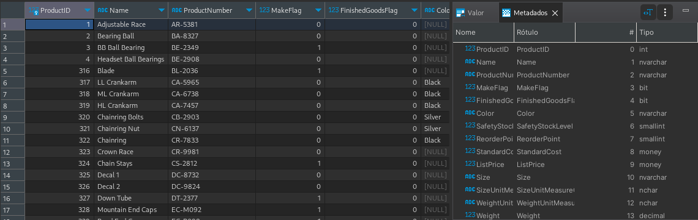

- `Dica`: Sempre que estiver trabalhando com uma nova tabela, é uma boa prática verificar primeiro alguns registros para entender a estrutura dos dados. Você pode fazer isso usando o comando `SELECT TOP 10 FROM` para ver apenas os 10 primeiros registros.

<details>
  <summary>Resposta</summary>

  Aqui está a resposta para o desafio do `Dia 1`:

```sql
SELECT 
    * 
FROM Production.Product;
```
</details>

## Dia 2: Filtrando Dados

- `Objetivo`: Aprofundar o entendimento sobre como filtrar registros em uma tabela usando critérios específicos.

- `Desafio`: Encontre todos os endereços da cidade de `Seattle`.

- `Instruções`:

1. Acesse seu ambiente SQL Server Management Studio (SSMS) ou a interface que você utiliza para interagir com o SQL Server.

2. Conecte-se ao banco de dados AdventureWorks.

3. No editor de consultas, você deve encontrar todos os clientes da cidade de `Seattle`:
    - Resultado esperado: A consulta retornará uma lista de todos os endereços que estão localizados na cidade de `Seattle`. Você deve ver uma lista de endereços, incluindo detalhes como ID de endereço, tipo de endereço, cidade, estado, país, entre outros.

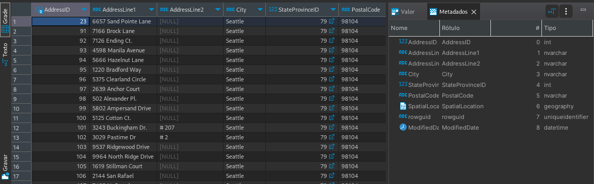

- Dica: A cláusula `WHERE` é uma das ferramentas mais poderosas em SQL, permitindo que você especifique exatamente quais registros deseja recuperar com base em critérios específicos. Familiarize-se com ela, pois será usada frequentemente em suas consultas.

<details>
  <summary>Resposta</summary>

Aqui está a resposta para o desafio do Dia 2:

```sql
SELECT 
    * 
FROM Person.Address
WHERE City = 'Seattle';
```
</details>

## Dia 3: Ordenação de Resultados

- `Objetivo`: Compreender como ordenar os resultados de uma consulta para facilitar a análise e apresentação dos dados.

- `Desafio`: Liste todos os nomes de pessoas em ordem alfabética.

- `Instruções`:

1. Acesse seu ambiente SQL Server Management Studio (SSMS) ou a interface que você utiliza para interagir com o SQL Server.

2. Conecte-se ao banco de dados AdventureWorks.

3. No editor de consultas, você deve listar todos os nomes de pessoas em ordem alfabética:
        
    - Resultado esperado: A consulta retornará uma lista de todos os nomes de pessoas, ordenados alfabeticamente pelo nome.

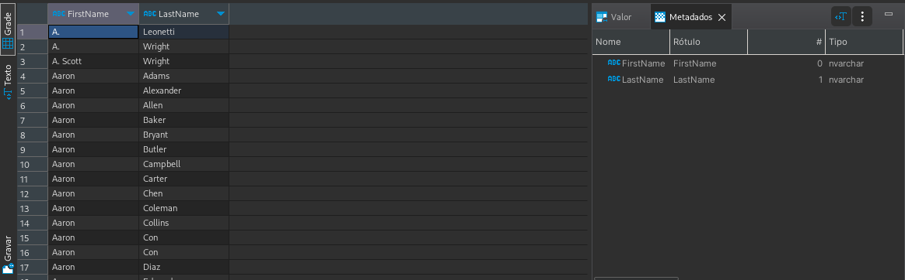

- Dica: A cláusula `ORDER BY` é usada em SQL para ordenar os resultados em ordem `ascendente` ou `descendente` com base em uma ou mais colunas.

<details>
  <summary>Resposta</summary>

Aqui está a resposta para o desafio do Dia 3:

```sql
SELECT 
    FirstName, LastName
FROM Person.Person
ORDER BY FirstName, LastName
```
</details>

Neste desafio, você aprendeu a importância de ordenar os resultados para facilitar a leitura e análise dos dados. Nos próximos dias, você explorará técnicas mais avançadas para manipular e apresentar dados usando SQL.

## Dia 4: Funções de Agregação Básicas

- `Objetivo`: Introduzir o conceito de funções de agregação e como elas podem ser usadas para resumir grandes volumes de dados.

- `Desafio`: Calcule o preço médio de todos os produtos.

- `Instruções`:

1. Acesse seu ambiente SQL Server Management Studio (SSMS) ou a interface que você utiliza para interagir com o SQL Server.

2. Conecte-se ao banco de dados AdventureWorks.

3. No editor de consultas, você deve calcular o preço médio de todos os produtos:
    - Resultado esperado: A consulta retornará o preço médio de todos os produtos disponíveis na tabela Product.

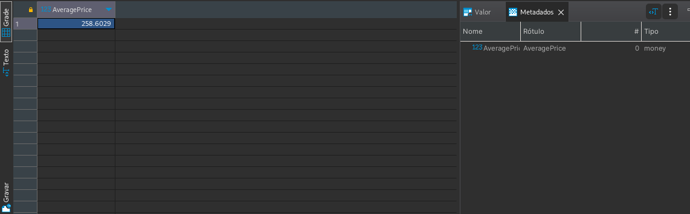

- Dica: A função `AVG()` é uma função de agregação que retorna a média dos valores em um grupo. Lembre-se de que funções de agregação, como `AVG()`, trabalham em conjunto com a cláusula `GROUP BY`, mas neste caso específico, como estamos calculando a média de todos os produtos, não precisamos dela.

<details>
  <summary>Resposta</summary>

Aqui está a resposta para o desafio do Dia 4:

```sql
SELECT 
    AVG(StandardCost) AS AveragePrice
FROM Production.Product;
```
</details>

Com este desafio, você começou a explorar as poderosas funções de agregação do SQL, que são essenciais para resumir e analisar grandes conjuntos de dados. Nos próximos dias, você se aprofundará em técnicas mais avançadas e aprenderá a combinar várias funções e cláusulas para obter insights mais profundos dos seus dados.

## Dia 5: Agrupando Dados

- `Objetivo`: Aprender a agrupar dados com base em colunas específicas e combinar isso com funções de agregação para obter resumos informativos dos dados.

- `Desafio`: Encontre o total de produtos por cor.

- `Instruções`:

1. Acesse seu ambiente SQL Server Management Studio (SSMS) ou a interface que você utiliza para interagir com o SQL Server.

2. Conecte-se ao banco de dados AdventureWorks.

3. No editor de consultas, você deve encontrar o total de produtos por cor:
    - Resultado esperado: A consulta retornará o número total de produtos para cada cor disponível no banco de dados.

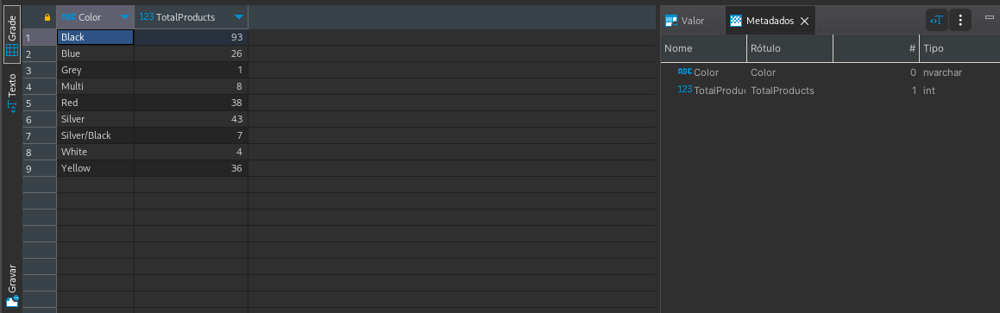

- Dica: A cláusula `GROUP BY` é usada em SQL para agrupar linhas que têm os mesmos valores em colunas especificadas. Quando combinada com funções de agregação, como `COUNT()`, você pode calcular estatísticas para cada grupo de linhas.

<details>
  <summary>Resposta</summary>

Aqui está a resposta para o desafio do Dia 5:

```sql
SELECT 
    Color,
    COUNT(*) AS TotalProducts
FROM Production.Product
WHERE Color IS NOT NULL
GROUP BY Color;
```
</details>

Neste desafio, você aprendeu a agrupar dados com base em uma coluna específica e a usar funções de agregação para obter um resumo dos dados. Isso é uma habilidade fundamental para analisar e entender grandes conjuntos de dados. Nos próximos dias, você se aprofundará em técnicas mais avançadas e aprenderá a combinar várias funções e cláusulas para obter insights mais profundos dos seus dados.

## Dia 6: Joins Básicos

- `Objetivo`: Introduzir o conceito de joins, que permitem combinar dados de duas ou mais tabelas com base em uma coluna relacionada entre elas.

- `Desafio`: Combine as tabelas `Product` e `ProductCategory` para listar produtos e suas categorias.

- `Instruções`:

1. Acesse seu ambiente SQL Server Management Studio (SSMS) ou a interface que você utiliza para interagir com o SQL Server.

2. Conecte-se ao banco de dados AdventureWorks.

3. No editor de consultas, você deve combinar as tabelas Product e ProductCategory para listar os produtos e suas respectivas categorias:
    - Resultado esperado: A consulta retornará uma lista de produtos junto com suas categorias.

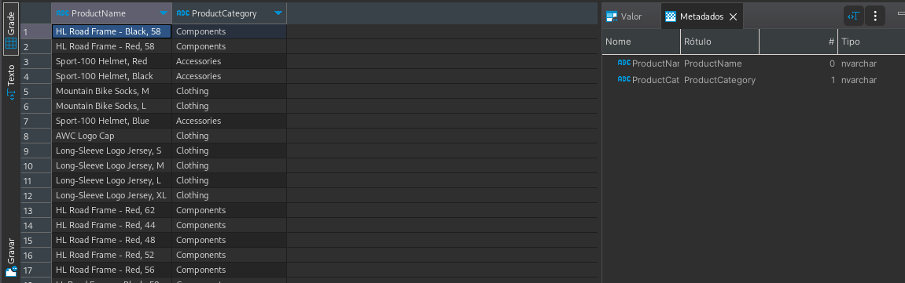

- Dica: O `INNER JOIN` é usado para combinar linhas de duas ou mais tabelas com base em uma coluna relacionada entre elas. Certifique-se de especificar a coluna pela qual as tabelas serão unidas.

<details>
  <summary>Resposta</summary>

Aqui está a resposta para o desafio do Dia 6:

```sql
SELECT 
    P.Name AS ProductName,
    PC.Name AS ProductCategory
FROM Production.Product P
INNER JOIN Production.ProductSubcategory PS ON P.ProductSubcategoryID = PS.ProductSubcategoryID
INNER JOIN Production.ProductCategory PC ON PS.ProductCategoryID = PC.ProductCategoryID;
```
</details>

Com este desafio, você deu o primeiro passo para entender como os joins funcionam em SQL. Eles são essenciais para combinar dados de diferentes tabelas e obter uma visão mais completa dos dados. Nos próximos dias, você explorará diferentes tipos de joins e aprenderá a usar cada um deles de acordo com suas necessidades específicas.

## Dia 7: Subconsultas

- `Objetivo`: Introduzir o conceito de subconsultas, que são consultas SQL aninhadas dentro de outra consulta. Elas são úteis para resolver consultas complexas que requerem várias etapas.

- `Desafio`: Encontre todos os clientes que fizeram mais de 5 pedidos.

- `Instruções`:

1. Acesse seu ambiente SQL Server Management Studio (SSMS) ou a interface que você utiliza para interagir com o SQL Server.

2. Conecte-se ao banco de dados AdventureWorks.

3. No editor de consultas, você deve identificar os clientes que fizeram mais de 5 pedidos:
    - Resultado esperado: A consulta retornará uma lista de clientes que fizeram mais de 5 pedidos.

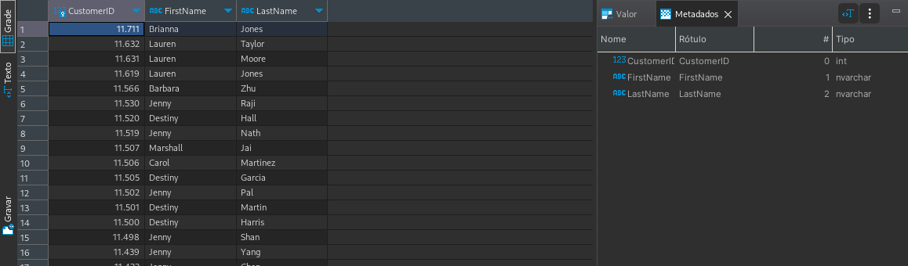

- Dica: `Subconsultas` são frequentemente usadas com operadores `IN`, `EXISTS` ou `ANY`. Elas podem ser usadas em cláusulas `SELECT`, `FROM` e `WHERE`.

<details>
  <summary>Resposta</summary>

Aqui está a resposta para o desafio do Dia 7:

```sql
SELECT 
    C.CustomerID,
    C.FirstName,
    C.LastName
FROM Sales.Customer AS C
WHERE C.CustomerID IN (
    SELECT 
        CustomerID 
    FROM Sales.SalesOrderHeader
    GROUP BY CustomerID
    HAVING COUNT(SalesOrderID) > 5
);
```
</details>

Com este desafio, você começou a explorar o poder das subconsultas em SQL. Elas são uma ferramenta valiosa para resolver problemas que não podem ser facilmente resolvidos com uma única consulta. À medida que você avança em sua jornada de aprendizado SQL, você encontrará muitos cenários em que as subconsultas são indispensáveis. Nos próximos dias, você se aprofundará em técnicas mais avançadas e aprenderá a combinar várias funções e cláusulas para obter insights mais profundos dos seus dados.

## Dia 8: Funções de Data

- `Objetivo`: Introduzir o conceito de funções de data, que permitem manipular e consultar dados com base em datas e horários.

- `Desafio`: Liste todos os pedidos feitos em janeiro de 2014.

- `Instruções`:

1. Acesse seu ambiente SQL Server Management Studio (SSMS) ou a interface que você utiliza para interagir com o SQL Server.

2. Conecte-se ao banco de dados AdventureWorks.

3. No editor de consultas, você deve identificar todos os pedidos feitos em janeiro de 2014:
    - Resultado esperado: A consulta retornará uma lista de pedidos feitos em janeiro de 2014, incluindo detalhes como ID do pedido, data do pedido, ID do cliente, entre outros.

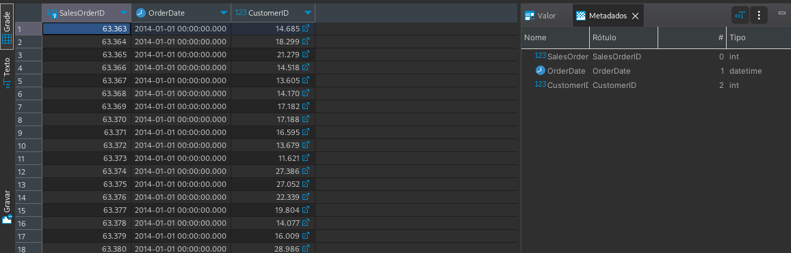

- Dica: O SQL Server fornece várias funções relacionadas à data, como `CAST` e `CONVERT`, que podem ser usadas para formatar e comparar datas.

<details>
  <summary>Resposta</summary>

Aqui está a resposta para o desafio do Dia 8:

```sql
SELECT 
    SalesOrderID,
    OrderDate,
    CustomerID
FROM Sales.SalesOrderHeader
WHERE MONTH(OrderDate) = 1 AND YEAR(OrderDate) = 2014;
```
</details>

Neste desafio, você explorou o poder das funções de data em SQL. Elas são essenciais para filtrar, agrupar e analisar dados com base em datas e horários. À medida que você avança em sua jornada de aprendizado SQL, você descobrirá que muitas análises e relatórios dependem fortemente de funções de data para fornecer insights oportunos e relevantes. Nos próximos dias, você se aprofundará em técnicas mais avançadas e aprenderá a combinar várias funções e cláusulas para obter insights mais profundos dos seus dados.

## Dia 9: Paginação de Resultados

- `Objetivo`: Introduzir o conceito de paginação de resultados, que permite exibir um subconjunto de registros de uma consulta, tornando mais gerenciável a visualização de grandes conjuntos de dados.

- `Desafio`: Mostre os primeiros 50 produtos, depois os próximos 50, e assim por diante.

- `Instruções`:

1. Acesse seu ambiente SQL Server Management Studio (SSMS) ou a interface que você utiliza para interagir com o SQL Server.

2. Conecte-se ao banco de dados AdventureWorks.

3. No editor de consultas, comece listando os primeiros 50 produtos:
    - Resultado esperado: A consulta retornará uma lista dos primeiros 50 produtos disponíveis na tabela Product, incluindo detalhes como ID do produto, nome, número do produto, cor, preço padrão, entre outros.

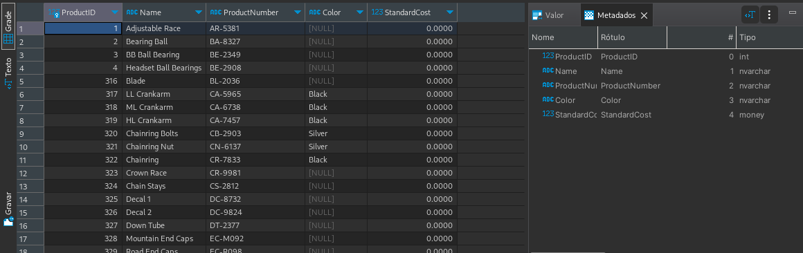

- Dica: O SQL Server fornece a cláusula `OFFSET` juntamente com `FETCH` para realizar a paginação de resultados.

<details>
  <summary>Resposta</summary>

Aqui estão as respostas para o desafio do Dia 9:

Primeiros 50 produtos:

```sql
SELECT 
    ProductID,
    Name,
    ProductNumber,
    Color,
    StandardCost
FROM Production.Product
ORDER BY ProductID
OFFSET 0 ROWS
FETCH NEXT 50 ROWS ONLY;
```
Próximos 50 produtos:

```sql
SELECT 
    ProductID,
    Name,
    ProductNumber,
    Color,
    StandardCost
FROM Production.Product
ORDER BY ProductID
OFFSET 50 ROWS
FETCH NEXT 50 ROWS ONLY;
```
E assim por diante, aumentando o valor do OFFSET em 50 para cada página subsequente.
</details>

Neste desafio, você explorou o conceito de paginação de resultados em SQL. A capacidade de paginar resultados é essencial ao trabalhar com grandes conjuntos de dados, pois permite que os usuários visualizem e gerenciem os dados de maneira mais eficaz. À medida que você avança em sua jornada de aprendizado SQL, você descobrirá que a paginação é uma técnica comum usada em muitas aplicações de banco de dados para melhorar a experiência do usuário. Nos próximos dias, você se aprofundará em técnicas mais avançadas e aprenderá a combinar várias funções e cláusulas para obter insights mais profundos dos seus dados.

## Dia 10: Joins Avançados

- `Objetivo`: Aprofundar o entendimento sobre joins, explorando combinações mais complexas que envolvem múltiplas tabelas.

- `Desafio`: Combine vendas com informações de vendedores e clientes.

- `Instruções`:

1. Acesse seu ambiente SQL Server Management Studio (SSMS) ou a interface que você utiliza para interagir com o SQL Server.

2. Conecte-se ao banco de dados AdventureWorks.

3. No editor de consultas, você deve combinar informações de vendas com detalhes dos vendedores e clientes:
    - Resultado esperado: A consulta retornará uma lista de vendas, incluindo detalhes como ID da venda, data da venda, nome do vendedor, nome do cliente, entre outros.

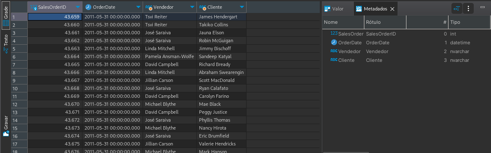

- Dica: Ao trabalhar com múltiplos joins, é uma boa prática usar `alias` para as tabelas, tornando a consulta mais legível.

<details>
  <summary>Resposta</summary>

Aqui está a resposta para o desafio do Dia 10:

```sql
SELECT 
    S.SalesOrderID,
    S.OrderDate,
    V.FirstName + ' ' + V.LastName AS Vendedor,
    C.FirstName + ' ' + C.LastName AS Cliente
FROM Sales.SalesOrderHeader AS S
JOIN Sales.SalesPerson AS SP ON S.SalesPersonID = SP.BusinessEntityID
JOIN HumanResources.Employee AS E ON SP.BusinessEntityID = E.BusinessEntityID
JOIN Person.Person AS V ON E.BusinessEntityID = V.BusinessEntityID
JOIN Sales.Customer AS SC ON S.CustomerID = SC.CustomerID
JOIN Person.Person AS C ON SC.PersonID = C.BusinessEntityID
ORDER BY S.SalesOrderID;
```
</details>

Neste desafio, você explorou o poder dos joins avançados em SQL. Ao combinar informações de várias tabelas, você pode obter uma visão mais completa e detalhada dos dados. Esta é uma habilidade essencial para analistas de dados e desenvolvedores de banco de dados, pois permite criar relatórios e análises mais ricos e informativos. Nos próximos dias, você continuará a explorar técnicas avançadas e aprenderá a otimizar suas consultas para obter o máximo de desempenho e eficiência.

## Dia 11: Funções de String

- `Objetivo`: Introduzir funções de manipulação de strings e demonstrar como elas podem ser usadas para filtrar e transformar dados baseados em critérios de texto.

- `Desafio`: Encontre todos os produtos que têm a palavra `bike` em seu nome.

- Instruções:

1. Acesse seu ambiente SQL Server Management Studio (SSMS) ou a interface que você utiliza para interagir com o SQL Server.

2. Conecte-se ao banco de dados AdventureWorks.

3. No editor de consultas, você deve buscar todos os produtos que contêm a palavra "bike" em seu nome:
    - Resultado esperado: A consulta retornará uma lista de produtos que têm a palavra `bike` em seu nome, incluindo detalhes como ID do produto, nome, número do produto, entre outros.

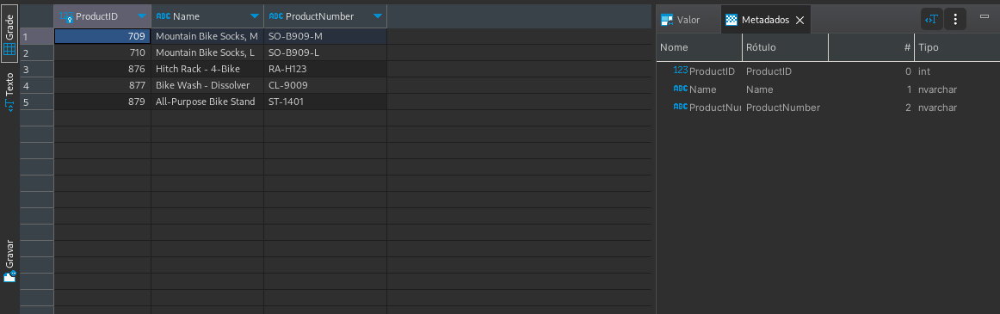

- Dica: O SQL Server fornece a função `CHARINDEX` que pode ser usada para encontrar a posição de uma string dentro de outra string. Se o resultado for maior que 0, significa que a string foi encontrada.

<details>
  <summary>Resposta</summary>

Aqui está a resposta para o desafio do Dia 11:

```sql
SELECT 
    ProductID,
    Name,
    ProductNumber
FROM Production.Product
WHERE CHARINDEX('bike', Name) > 0;
```
</details>

Neste desafio, você explorou uma das muitas funções de string disponíveis no SQL Server. As funções de string são ferramentas poderosas que permitem aos analistas de dados filtrar, transformar e analisar dados baseados em critérios de texto. Ao dominar essas funções, você será capaz de realizar análises mais complexas e obter insights mais profundos dos seus dados. Nos próximos dias, você continuará a explorar funções e técnicas avançadas, ampliando ainda mais seu conjunto de habilidades em SQL.

## Dia 12: CTEs e Subconsultas Avançadas

- `Objetivo`: Introduzir o conceito de `Common Table Expressions (CTEs)` e demonstrar como eles podem ser combinados com subconsultas para realizar análises avançadas.

- `Desafio`: Use CTEs para analisar a sequência de pedidos de clientes.

- `Instruções`:

1. Acesse seu ambiente SQL Server Management Studio (SSMS) ou a interface que você utiliza para interagir com o SQL Server.

2. Conecte-se ao banco de dados AdventureWorks.

3. No editor de consultas, você deve usar CTEs para analisar a sequência de pedidos de clientes:
    - Resultado esperado: A consulta retornará uma lista de clientes e a sequência de seus pedidos, mostrando a data de cada pedido e o intervalo de tempo entre eles.

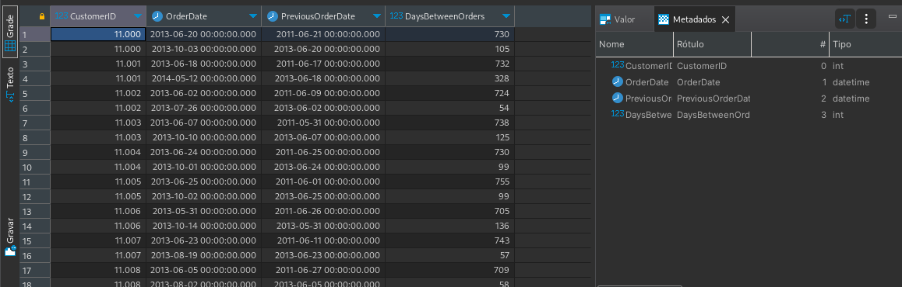

- Dica: `CTEs` são uma ferramenta poderosa que permite criar consultas temporárias para serem usadas em uma consulta principal. Eles são especialmente úteis para simplificar consultas complexas e torná-las mais legíveis.

<details>
  <summary>Resposta</summary>

Aqui está a resposta para o desafio do Dia 12:

```sql
WITH OrderSequences AS (
    SELECT 
        CustomerID,
        OrderDate,
        LAG(OrderDate, 1) OVER (PARTITION BY CustomerID ORDER BY OrderDate) AS PreviousOrderDate
    FROM Sales.SalesOrderHeader
)

SELECT 
    CustomerID,
    OrderDate,
    PreviousOrderDate,
    DATEDIFF(day, PreviousOrderDate, OrderDate) AS DaysBetweenOrders
FROM OrderSequences
WHERE PreviousOrderDate IS NOT NULL
ORDER BY CustomerID, OrderDate;
```
</details>

Neste desafio, você explorou o poder das CTEs e subconsultas avançadas no SQL Server. Ao combinar essas técnicas, você pode realizar análises mais profundas e obter insights valiosos sobre seus dados. CTEs são especialmente úteis para simplificar e organizar consultas complexas, tornando-as mais legíveis e manuteníveis. Nos próximos dias, você continuará a aprofundar seu conhecimento em técnicas avançadas de SQL, preparando-se para enfrentar desafios ainda mais complexos.

## Dia 13: Funções de Janela

- `Objetivo`: Introduzir o conceito de funções de janela e demonstrar como elas podem ser usadas para identificar e lidar com registros duplicados.

- `Desafio`: Use a função `ROW_NUMBER()` para identificar produtos com nomes duplicados.

- `Instruções`:

1. Acesse seu ambiente SQL Server Management Studio (SSMS) ou a interface que você utiliza para interagir com o SQL Server.

2. Conecte-se ao banco de dados AdventureWorks.

3. No editor de consultas, você deve usar a função `ROW_NUMBER()` para identificar produtos com nomes duplicados:
    - Resultado esperado: A consulta retornará uma lista de produtos com nomes duplicados, juntamente com um número de linha que indica a ordem em que o produto aparece.

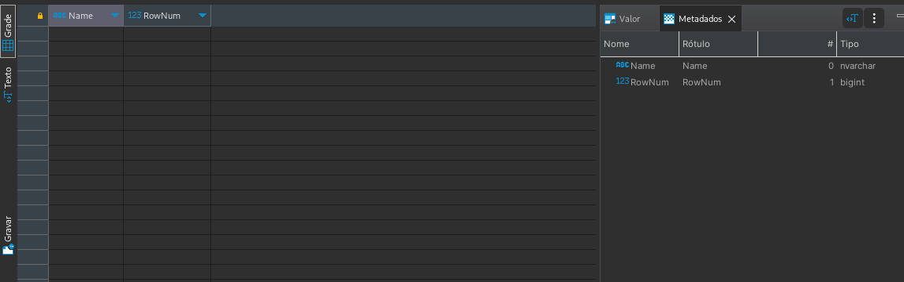

- Dica: A função `ROW_NUMBER()` pode ser combinada com a cláusula `PARTITION BY` para reiniciar a contagem de linhas para cada grupo de registros duplicados.

<details>
  <summary>Resposta</summary>

Aqui está a resposta para o desafio do Dia 13:

```sql
WITH Duplicates AS (
    SELECT 
        Name,
        ROW_NUMBER() OVER (PARTITION BY Name ORDER BY ProductID) AS RowNum
    FROM Production.Product
)

SELECT 
    Name,
    RowNum
FROM Duplicates
WHERE RowNum > 1;
```
</details>

Neste desafio, você explorou o poder das funções de janela no SQL Server para identificar registros duplicados. Identificar e lidar com registros duplicados é uma tarefa comum em análise de dados e ETL. Ao dominar a função `ROW_NUMBER()`, você terá uma ferramenta poderosa para lidar com esse tipo de situação. Nos próximos dias, você continuará a expandir seu conjunto de habilidades em SQL, abordando tópicos ainda mais avançados.

## Dia 14: Indexação

- `Objetivo`: Compreender a importância da indexação para otimizar consultas e aprender a analisar planos de execução para identificar oportunidades de melhoria.

- `Desafio`: Analise o plano de execução e sugira índices para otimizar uma consulta complexa.

- `Instruções`:

1. Acesse seu ambiente SQL Server Management Studio (SSMS) ou a interface que você utiliza para interagir com o SQL Server.

2. Conecte-se ao banco de dados AdventureWorks.

3. Execute uma consulta complexa e abra o plano de execução:
    - Para visualizar o plano de execução, clique no ícone `Display Estimated Execution Plan` ou pressione `Ctrl + L`.
        
    - Analise os operadores no plano de execução e identifique aqueles que têm um custo relativo alto.
        
    - Preste atenção especial aos operadores de `Scan`, pois eles indicam que o SQL Server teve que ler uma tabela ou índice inteiro. Um `Seek` geralmente é mais eficiente do que um `Scan`.

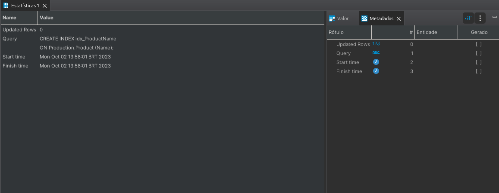

- Dica: Ao analisar o plano de execução, procure por avisos (ícones de triângulo amarelo). Eles podem indicar oportunidades para otimização, como a adição de um índice.

<details>
  <summary>Resposta</summary>

A resposta exata dependerá da consulta específica e do estado atual do banco de dados. No entanto, uma resposta possível pode ser:

```sql
-- Sugestão de índice baseada no plano de execução
CREATE INDEX idx_ProductName
ON Production.Product (Name);
```

Lembre-se de que a criação de índices pode acelerar as consultas de seleção, mas também pode desacelerar as operações de inserção, atualização e exclusão. Portanto, é importante testar o impacto de novos índices em um ambiente de desenvolvimento ou teste antes de aplicá-los em produção.
</details>

Neste desafio, você teve a oportunidade de mergulhar na otimização de consultas e entender como os índices podem melhorar significativamente o desempenho das consultas. A indexação é uma ferramenta poderosa na caixa de ferramentas de um desenvolvedor ou analista de banco de dados. Ao compreender como e quando usar índices, você pode garantir que suas consultas sejam executadas de maneira eficiente, mesmo em grandes conjuntos de dados. Nos próximos dias, você continuará a expandir seu conjunto de habilidades em SQL, abordando tópicos ainda mais avançados.

## Dia 15: Triggers

- `Objetivo`: Introduzir o conceito de `triggers` e demonstrar como eles podem ser usados para monitorar e reagir a alterações em tabelas.

- `Desafio`: Crie um trigger para registrar alterações de preço em uma tabela de histórico.

- `Instruções`:

1. Acesse seu ambiente SQL Server Management Studio (SSMS) ou a interface que você utiliza para interagir com o SQL Server.

2. Conecte-se ao banco de dados AdventureWorks.

3. Primeiro, crie uma tabela de histórico para registrar as alterações de preço:

```sql
CREATE TABLE ProductPriceHistory (
    HistoryID INT PRIMARY KEY IDENTITY(1,1),
    ProductID INT,
    OldPrice MONEY,
    NewPrice MONEY,
    ChangeDate DATETIME DEFAULT GETDATE()
);
```

4. Em seguida, crie um trigger na tabela Product para registrar qualquer alteração no preço dos produtos.

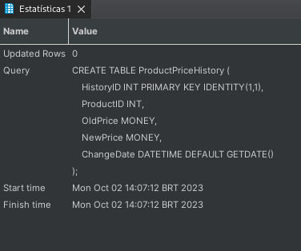

- Dica: Triggers podem ser poderosos, mas também podem afetar a performance. Use-os com cautela e sempre teste em um ambiente de desenvolvimento antes de aplicar em produção.

<details>
  <summary>Resposta</summary>

Aqui está a resposta para o desafio do Dia 15:

- Trigger:

```sql
CREATE TRIGGER tr_ProductPriceChange
ON Production.Product
AFTER UPDATE
AS
BEGIN
    INSERT INTO ProductPriceHistory (ProductID, OldPrice, NewPrice)
    SELECT 
        i.ProductID,
        d.ListPrice AS OldPrice,
        i.ListPrice AS NewPrice
    FROM 
        INSERTED i
    JOIN 
        DELETED d ON i.ProductID = d.ProductID
    WHERE 
        i.ListPrice != d.ListPrice;
END;
```
</details>

Ao final deste desafio, você deve ser capaz de entender o propósito dos triggers e como eles podem ser usados para monitorar e reagir a alterações em tabelas. Triggers são uma ferramenta poderosa, mas também complexa. É importante entender quando e como usá-los para garantir que eles sejam benéficos e não prejudiciais ao desempenho do seu banco de dados.

## Dia 16: Procedures Básicas

- `Objetivo`: Introduzir o conceito de procedures armazenadas e demonstrar como elas podem ser usadas para recuperar informações detalhadas sobre os pedidos de um cliente específico.

- Desafio: Crie uma procedure para obter os detalhes dos pedidos de um cliente específico.

- `Instruções`:

1. Acesse seu ambiente SQL Server Management Studio (SSMS) ou a interface que você utiliza para interagir com o SQL Server.

2. Conecte-se ao banco de dados AdventureWorks.

3. Crie a procedure para obter os detalhes dos pedidos de um cliente específico.

4. Para usar a procedure e obter os detalhes dos pedidos de um cliente específico, execute o seguinte:

```sql
EXEC sp_DetalhesPedidosCliente @ClienteID = [Insira o ID do Cliente Aqui];
```

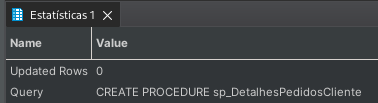

- Dica: Procedures armazenadas são úteis para encapsular lógicas de negócios e garantir a consistência das operações. Ao criar procedures, é importante validar os dados de entrada e tratar possíveis erros para garantir a integridade dos dados. Esta procedure em particular ajuda a obter uma visão detalhada dos pedidos de um cliente, o que pode ser útil para análises de vendas, atendimento ao cliente e outras operações de negócios.

<details>
  <summary>Resposta</summary>

Aqui está a resposta para o desafio do Dia 16:

- Procedure:

```sql
CREATE PROCEDURE sp_DetalhesPedidosCliente
    @ClienteID INT
AS
BEGIN
    SELECT 
        salesh.SalesOrderID AS PedidoID,
        salesh.OrderDate AS DataPedido,
        produto.ProductID,
        produto.Name AS NomeProduto,
        salesdetail.OrderQty AS Quantidade,
        salesdetail.UnitPrice AS PrecoUnitario,
        (salesdetail.OrderQty * salesdetail.UnitPrice) AS TotalItem
    FROM 
        Sales.SalesOrderHeader salesh
        JOIN Sales.SalesOrderDetail salesdetail ON salesh.SalesOrderID = salesdetail.SalesOrderID
        JOIN Production.Product produto ON salesdetail.ProductID = produto.ProductID
    WHERE 
        salesh.CustomerID = @ClienteID
    ORDER BY 
        salesh.OrderDate DESC, 
        produto.Name;
END;
```
</details>

## Dia 17: Views Básicas

- `Objetivo`: Introduzir o conceito de views e demonstrar como elas podem ser usadas para simplificar consultas complexas e proporcionar uma camada de abstração sobre as tabelas.

- `Desafio`: Crie uma view que combine informações de produtos e vendas.

- `Instruções`:

1. Acesse seu ambiente SQL Server Management Studio (SSMS) ou a interface que você utiliza para interagir com o SQL Server.

2. Conecte-se ao banco de dados AdventureWorks.

3. Crie uma view que combine informações da tabela de produtos e da tabela de detalhes de vendas. Esta view deve mostrar o nome do produto, o número do produto, a quantidade vendida e o preço unitário.

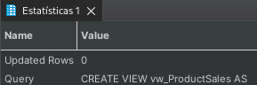

- Dica: Views são uma excelente maneira de simplificar consultas complexas e fornecer uma interface mais amigável para usuários menos técnicos. Elas também podem ser úteis para impor uma camada de segurança, permitindo que os usuários acessem apenas os dados que eles têm permissão para ver.

<details>
  <summary>Resposta</summary>

Aqui está a resposta para o desafio do Dia 17:

- View:

```sql
CREATE VIEW vw_ProductSales AS
SELECT 
    p.Name AS ProductName,
    p.ProductNumber,
    sd.OrderQty AS QuantitySold,
    sd.UnitPrice
FROM 
    Production.Product p
JOIN 
    Sales.SalesOrderDetail sd ON p.ProductID = sd.ProductID;
```

</details>

Ao final deste desafio, você deve ser capaz de entender o propósito das views e como elas podem ser usadas para simplificar e otimizar consultas. Views são uma ferramenta essencial para qualquer desenvolvedor ou analista de banco de dados, pois permitem criar uma representação virtual dos dados que pode ser reutilizada em várias consultas.

## Dia 18: Tabelas Temporárias e Variáveis

- `Objetivo`: Introduzir o conceito de tabelas temporárias e variáveis e demonstrar como elas podem ser usadas para simplificar e otimizar consultas complexas, dividindo-as em etapas menores e mais gerenciáveis.

- `Desafio`: Use tabelas temporárias para dividir uma análise complexa em etapas.

- `Instruções`:

1. Acesse seu ambiente SQL Server Management Studio (SSMS) ou a interface que você utiliza para interagir com o SQL Server.

2. Conecte-se ao banco de dados AdventureWorks.

3. Suponha que você queira analisar as vendas de produtos por categoria e, em seguida, identificar os produtos mais vendidos em cada categoria. Para fazer isso, primeiro crie uma tabela temporária para armazenar as vendas totais por categoria.

4. Em seguida, usando a tabela temporária, identifique o produto mais vendido em cada categoria.

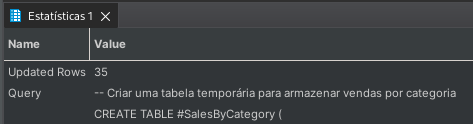

- Dica: Tabelas temporárias e variáveis são extremamente úteis para dividir consultas complexas em etapas menores, tornando-as mais fáceis de entender e otimizar. Elas também são úteis para armazenar resultados intermediários que podem ser reutilizados em várias partes de uma consulta ou procedimento.

<details>
  <summary>Resposta</summary>

Aqui está a resposta para o desafio do Dia 18:

- Cria e Insere os dados:

```sql
-- Criar uma tabela temporária para armazenar vendas por categoria
CREATE TABLE #SalesByCategory (
    CategoryID INT,
    TotalSales MONEY
);

-- Preencher a tabela temporária com dados
-- Criar uma tabela temporária para armazenar vendas por categoria
CREATE TABLE #SalesByCategory (
    CategoryID INT,
    TotalSales MONEY
);

-- Preencher a tabela temporária com dados
INSERT INTO #SalesByCategory (CategoryID, TotalSales)
SELECT 
    p.ProductSubcategoryID,
    SUM(sod.UnitPrice * sod.OrderQty) AS TotalSales
FROM 
    Production.Product p
JOIN 
    Sales.SalesOrderDetail sod ON p.ProductID = sod.ProductID
GROUP BY 
    p.ProductSubcategoryID;
```

- Consulta usando a tabela temporária:

```sql
-- Usando a tabela temporária para identificar o produto mais vendido em cada subcategoria
SELECT 
    sc.CategoryID,
    p.Name AS MostSoldProductName,
    MAX(sod.UnitPrice * sod.OrderQty) AS Sales
FROM 
    #SalesByCategory sc
JOIN 
    Production.Product p ON sc.CategoryID = p.ProductSubcategoryID
JOIN 
    Sales.SalesOrderDetail sod ON p.ProductID = sod.ProductID
GROUP BY 
    sc.CategoryID, p.Name;
```

- Não se esqueça de limpar após o uso:

```sql
DROP TABLE #SalesByCategory;
```

</details>

Ao final deste desafio, você deve ser capaz de entender a utilidade das tabelas temporárias e variáveis no SQL e como elas podem ser usadas para simplificar e otimizar consultas complexas. Elas são ferramentas essenciais que todo desenvolvedor ou analista de banco de dados deve conhecer e usar adequadamente.

## Dia 19: Funções Personalizadas

- `Objetivo`: Introduzir o conceito de funções personalizadas no SQL Server e demonstrar como elas podem ser usadas para encapsular lógicas de consulta complexas, tornando-as reutilizáveis.

- `Desafio`: Crie uma função para calcular o total de vendas de um produto específico.

- `Instruções`:

1. Acesse seu ambiente SQL Server Management Studio (SSMS) ou a interface que você utiliza para interagir com o SQL Server.

2. Conecte-se ao banco de dados AdventureWorks.

3. Crie uma função chamada `fn_TotalSalesForProduct` que aceite um `ID de produto` como parâmetro e retorne o total de vendas para esse produto.

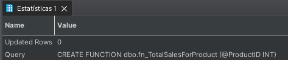

- Dica: Funções personalizadas são uma maneira poderosa de encapsular lógicas de consulta que você usa frequentemente. Elas permitem que você mantenha sua lógica em um único lugar, tornando suas consultas mais limpas e mais fáceis de manter.

<details>
  <summary>Resposta</summary>

Aqui está a resposta para o desafio do Dia 19:

- Cria a função:
```sql
CREATE FUNCTION dbo.fn_TotalSalesForProduct (@ProductID INT)
RETURNS MONEY
AS
BEGIN
    DECLARE @TotalSales MONEY

    SELECT 
        @TotalSales = SUM(sod.UnitPrice * sod.OrderQty)
    FROM 
        Sales.SalesOrderDetail sod
    WHERE 
        sod.ProductID = @ProductID;

    RETURN @TotalSales
END;
```

- Usando a função personalizada:

```sql
-- Para obter o total de vendas do produto com ID 707:
SELECT dbo.fn_TotalSalesForProduct(707) AS TotalSales;
```
</details>

Ao final deste desafio, você deve ser capaz de entender a utilidade das funções personalizadas no SQL Server e como elas podem ser usadas para encapsular lógicas de consulta complexas. Funções personalizadas são uma ferramenta essencial que todo desenvolvedor ou analista de banco de dados deve conhecer e usar adequadamente.

## Dia 20: Procedures Avançadas

- `Objetivo`: Aprofundar o entendimento sobre procedures no SQL Server e demonstrar como elas podem ser usadas para automatizar tarefas recorrentes, como a geração de relatórios.

- `Desafio`: Desenvolva uma procedure para gerar relatórios mensais de vendas.

- `Instruções`:

1. Acesse seu ambiente SQL Server Management Studio (SSMS) ou a interface que você utiliza para interagir com o SQL Server.

2. Conecte-se ao banco de dados AdventureWorks.

3. Crie uma procedure chamada sp_MonthlySalesReport que aceite um mês e um ano como parâmetros e retorne um relatório de vendas para esse mês.
    - Uma vez que a procedure esteja criada, você pode executá-la para obter o relatório de vendas para um mês específico.

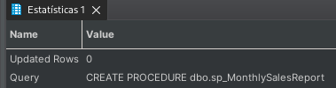

- Dica: Procedures são uma maneira eficaz de encapsular lógicas de consulta que são executadas regularmente. Elas também podem aceitar parâmetros, tornando-as flexíveis e reutilizáveis.

<details>
  <summary>Resposta</summary>

Aqui está a resposta para o desafio do Dia 20:
sql

- Cria a procedure:

```sql
CREATE PROCEDURE dbo.sp_MonthlySalesReport 
    @Month INT,
    @Year INT
AS
BEGIN
    SELECT 
        YEAR(soh.OrderDate) AS Year,
        MONTH(soh.OrderDate) AS Month,
        sod.ProductID,
        p.Name AS ProductName,
        SUM(sod.OrderQty) AS TotalQuantitySold,
        SUM(sod.LineTotal) AS TotalSalesAmount
    FROM 
        Sales.SalesOrderHeader soh
    JOIN 
        Sales.SalesOrderDetail sod ON soh.SalesOrderID = sod.SalesOrderID
    JOIN 
        Production.Product p ON sod.ProductID = p.ProductID
    WHERE 
        MONTH(soh.OrderDate) = @Month AND YEAR(soh.OrderDate) = @Year
    GROUP BY 
        YEAR(soh.OrderDate),
        MONTH(soh.OrderDate),
        sod.ProductID,
        p.Name
    ORDER BY 
        TotalSalesAmount DESC;
END;
```

- Usando a procedure avançada:

```sql
-- Para obter o relatório de vendas para janeiro de 2014:
EXEC dbo.sp_MonthlySalesReport @Month = 1, @Year = 2014;
```
</details>

Ao final deste desafio, você deve ser capaz de entender a utilidade das procedures avançadas no SQL Server e como elas podem ser usadas para automatizar tarefas recorrentes. Procedures são uma ferramenta poderosa que todo desenvolvedor ou analista de banco de dados deve dominar.

## Dia 21: Views Avançadas

- `Objetivo`: Aprofundar o entendimento sobre views no SQL Server e demonstrar como elas podem ser usadas para simplificar consultas complexas e análises de tendências.

- `Desafio`: Crie uma view para análise de tendências de vendas.

- `Instruções`:

1. Acesse seu ambiente SQL Server Management Studio (SSMS) ou a interface que você utiliza para interagir com o SQL Server.

2. Conecte-se ao banco de dados AdventureWorks.

3. Crie uma view chamada vw_SalesTrends que forneça uma análise mensal das vendas, mostrando a quantidade total de produtos vendidos e o valor total de vendas para cada mês.
    - Uma vez que a view esteja criada, você pode consultá-la para obter uma análise de tendências de vendas ao longo dos meses.

- Dica: Views são uma maneira excelente de encapsular consultas complexas, tornando-as mais legíveis e reutilizáveis. Elas também podem ser usadas como base para outras consultas, agregando ainda mais valor.

<details>
  <summary>Resposta</summary>

Aqui está a resposta para o desafio do Dia 21:
sql

- Cria a view:

```sql
CREATE VIEW dbo.vw_SalesTrends AS
    SELECT 
        YEAR(soh.OrderDate) AS SalesYear,
        MONTH(soh.OrderDate) AS SalesMonth,
        COUNT(DISTINCT soh.SalesOrderID) AS TotalOrders,
        SUM(sod.OrderQty) AS TotalQuantitySold,
        SUM(sod.LineTotal) AS TotalSalesAmount
    FROM 
        Sales.SalesOrderHeader soh
    JOIN 
        Sales.SalesOrderDetail sod ON soh.SalesOrderID = sod.SalesOrderID
    GROUP BY 
        YEAR(soh.OrderDate),
        MONTH(soh.OrderDate)
```

- Usando a view avançada:

```sql
-- Para obter a análise de tendências de vendas:
SELECT * FROM dbo.vw_SalesTrends
    ORDER BY 
        SalesYear,
        SalesMonth;
```
</details>

Ao final deste desafio, você deve ser capaz de entender a utilidade das views avançadas no SQL Server e como elas podem ser usadas para simplificar e otimizar consultas complexas. Views são uma ferramenta essencial que todo desenvolvedor ou analista de banco de dados deve conhecer e usar efetivamente.


## Dia 22: Erros e Exceções

- `Objetivo`: Introduzir o conceito de tratamento de erros no SQL Server e demonstrar como lidar com erros e exceções em procedures usando os blocos `TRY`...`CATCH`.

- `Desafio`: Crie uma procedure que tente dividir um número por zero (uma operação inválida) e trate esse erro usando um bloco `TRY`...`CATCH`.

- `Instruções`:

1. Acesse seu ambiente SQL Server Management Studio (SSMS) ou a interface que você utiliza para interagir com o SQL Server.

2. Conecte-se ao banco de dados AdventureWorks.

3. Crie uma procedure chamada sp_DivideByZero que tentará dividir um número por zero e capturará esse erro usando um bloco `TRY`...`CATCH`.
    - Execute a procedure para ver o tratamento de erros em ação.

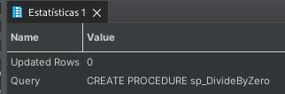

- Dica: O tratamento de erros é crucial em qualquer aplicação ou script. No SQL Server, o bloco `TRY`...`CATCH` oferece uma maneira robusta de capturar e tratar erros, permitindo que você tome ações específicas quando ocorrerem exceções.

<details>
  <summary>Resposta</summary>

Aqui está a resposta para o desafio do Dia 22:

- Criando a Procedure
```sql
CREATE PROCEDURE sp_DivideByZero
AS
BEGIN
    BEGIN TRY
        -- Esta operação causará um erro de divisão por zero
        PRINT 1 / 0
    END TRY
    BEGIN CATCH
        PRINT 'Ocorreu um erro: ' + ERROR_MESSAGE()
    END CATCH
END;
```

- Executando a procedure:

```sql
EXEC sp_DivideByZero;
```

Ao executar a procedure, você verá a mensagem de erro personalizada em vez de um erro de sistema.
</details>

Ao final deste desafio, você deve ser capaz de entender a importância do tratamento de erros e como implementá-lo no SQL Server. O tratamento adequado de erros não apenas melhora a robustez de suas procedures e scripts, mas também oferece uma melhor experiência ao usuário, fornecendo mensagens de erro claras e ações corretivas sugeridas.

## Dia 23: Transações

- `Objetivo`: Introduzir o conceito de transações no SQL Server e demonstrar como elas podem ser usadas para garantir a integridade dos dados durante operações complexas.

- `Desafio`: Crie uma procedure que tente inserir registros em duas tabelas diferentes. Se a inserção em uma das tabelas falhar, a operação inteira deve ser revertida.

- `Instruções`:

1. Acesse seu ambiente SQL Server Management Studio (SSMS) ou a interface que você utiliza para interagir com o SQL Server.

2. Conecte-se ao banco de dados AdventureWorks.

3. Crie uma procedure chamada sp_InsertWithTransaction que tentará inserir registros em duas tabelas diferentes. Se ocorrer um erro em qualquer uma das inserções, a transação inteira será revertida.
    - Execute a procedure para ver o conceito de transações em ação.

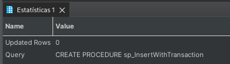

- Dica: Transações são vitais quando se trabalha com operações que envolvem múltiplas tabelas ou registros. Elas garantem que, se uma parte da operação falhar, todas as alterações feitas durante essa transação sejam revertidas, mantendo a integridade dos dados.

<details>
  <summary>Resposta</summary>

Aqui está a resposta para o desafio do Dia 23:

- Criando a Procedure

```sql
CREATE PROCEDURE sp_InsertWithTransaction
AS
BEGIN
    BEGIN TRY
        BEGIN TRANSACTION; -- Inicia a transação

        -- Tente inserir na tabela Sales.Customer
        INSERT INTO Sales.Customer (PersonID, TerritoryID)
        VALUES (1, 1);

        -- Tente inserir na tabela Production.Product
        INSERT INTO Production.Product (Name, ProductNumber, StandardCost, ListPrice, DaysToManufacture, SafetyStockLevel, ReorderPoint, SellStartDate)
        VALUES ('Produto Exemplo', 'PE-0001', 0.0, 0.0, 0, 0, 0, GETDATE());

        COMMIT; -- Se ambas as inserções forem bem-sucedidas, confirme a transação
    END TRY
    BEGIN CATCH
        ROLLBACK; -- Se ocorrer um erro em qualquer inserção, reverta a transação
        PRINT 'Ocorreu um erro: ' + ERROR_MESSAGE();
    END CATCH
END;
```

- Executando a procedure:

```sql
EXEC sp_InsertWithTransaction;
```
Ao executar a procedure, se ambas as inserções forem bem-sucedidas, os registros serão inseridos em ambas as tabelas. Se ocorrer um erro em qualquer uma das inserções, nenhuma das tabelas terá novos registros, e você verá a mensagem de erro personalizada.
</details>

Ao final deste desafio, você deve ser capaz de entender a importância das transações e como implementá-las no SQL Server. Transações garantem que as operações sejam `tudo ou nada`, o que é crucial para manter a integridade dos dados em cenários complexos.

## Dia 24: Otimização de Consultas

- `Objetivo`: Introduzir o conceito de otimização de consultas e demonstrar como o plano de execução pode ser usado para identificar gargalos e melhorar o desempenho das consultas.

- `Desafio`: Dada uma consulta que está executando lentamente, use o plano de execução para identificar áreas de melhoria e otimize a consulta.

- `Instruções`:

1. Acesse seu ambiente SQL Server Management Studio (SSMS) ou a interface que você utiliza para interagir com o SQL Server.

2. Conecte-se ao banco de dados AdventureWorks.

3. Execute a seguinte consulta, que está deliberadamente escrita de forma ineficiente:

```sql
SELECT 
    p.ProductID
    , p.Name
    , p.ProductNumber
    , p.StandardCost
    , p.ListPrice
    , s.OrderDate
    , s.SalesOrderID
    , s.TotalDue
FROM Production.Product p
    , Sales.SalesOrderHeader s
WHERE p.ProductID = s.SalesOrderID;
```

- Após a execução, clique com o botão direito do mouse no resultado e selecione `Mostrar Plano de Execução` para visualizar o plano.

- Analise o plano de execução. Procure por ícones de alerta amarelos ou áreas do plano que consomem uma alta porcentagem de custo relativo.


- Dica: O plano de execução fornece uma representação visual de como o SQL Server processou sua consulta. Operações como `Scan` podem ser mais lentas do que `Seek`. Ícones de alerta amarelos podem indicar operações que o SQL Server teve que fazer, como `spools` ou conversões de tipo, que podem ser otimizadas.

<details>
  <summary>Resposta</summary>

Aqui está a resposta para o desafio do Dia 24:

- Consulta otimizada:

```sql

SELECT 
    p.ProductID
    , p.Name
    , p.ProductNumber
    , p.StandardCost
    , p.ListPrice
    , s.OrderDate
    , s.SalesOrderID
    , s.TotalDue
FROM Production.Product p
JOIN Sales.SalesOrderHeader s ON p.ProductID = s.SalesOrderID;
```

Ao usar a cláusula JOIN explícita em vez de uma junção implícita, a consulta é mais clara e pode ser otimizada pelo SQL Server. Além disso, ao analisar o plano de execução, você pode identificar outras áreas de melhoria, como a adição de índices.
</details>

Ao final deste desafio, você deve ser capaz de entender a importância da otimização de consultas e como usar o plano de execução como uma ferramenta valiosa para melhorar o desempenho das suas consultas no SQL Server.

## Dia 25: Análise de Dados com SQL

- `Objetivo`: Aprender a usar SQL para extrair insights valiosos a partir dos dados de vendas históricos.

- `Desafio`: Dado o banco de dados AdventureWorks, identifique tendências de vendas ao longo do tempo, os produtos mais vendidos e os clientes mais frequentes.

- `Instruções`:

1. Acesse seu ambiente SQL Server Management Studio (SSMS) ou a interface que você utiliza para interagir com o SQL Server.

2. Conecte-se ao banco de dados AdventureWorks.

3. Comece analisando as vendas mensais ao longo dos anos disponíveis no banco de dados:
    - Resultado esperado: Um resumo das vendas mensais, mostrando a evolução das vendas ao longo do tempo.

4. Em seguida, identifique os top 10 produtos mais vendidos:
    - Resultado esperado: Uma lista dos 10 produtos mais vendidos, com a quantidade total vendida e o valor total de vendas.
    
5. Por fim, identifique os top 5 clientes com mais compras:
    - Resultado esperado: Uma lista dos 5 clientes que mais fizeram compras, com o número total de pedidos e o valor total gasto.

- Dica: Ao analisar dados históricos, é importante considerar o contexto da época. Por exemplo, se houve uma promoção ou evento especial, isso pode ter influenciado as vendas.

<details>
  <summary>Resposta</summary>

Aqui estão algumas consultas que você pode usar para responder aos desafios do Dia 25:

- Vendas mensais ao longo dos anos:

```sql
SELECT 
    YEAR(OrderDate) AS Ano,
    MONTH(OrderDate) AS Mes,
    SUM(TotalDue) AS TotalVendas
FROM Sales.SalesOrderHeader
GROUP BY YEAR(OrderDate), MONTH(OrderDate)
ORDER BY Ano, Mes;
```

- Top 10 produtos mais vendidos:

```sql
SELECT 
    p.ProductID,
    p.Name AS NomeProduto,
    SUM(sod.OrderQty) AS QuantidadeVendida,
    SUM(sod.LineTotal) AS ValorTotalVendas
FROM Production.Product p
JOIN Sales.SalesOrderDetail sod ON p.ProductID = sod.ProductID
GROUP BY p.ProductID, p.Name
ORDER BY ValorTotalVendas DESC
LIMIT 10;
```

- Top 5 clientes com mais compras:

```sql
SELECT 
    c.CustomerID,
    COUNT(DISTINCT soh.SalesOrderID) AS NumeroPedidos,
    SUM(soh.TotalDue) AS ValorTotalGasto
FROM Sales.Customer c
JOIN Sales.SalesOrderHeader soh ON c.CustomerID = soh.CustomerID
GROUP BY c.CustomerID
ORDER BY ValorTotalGasto DESC
LIMIT 5;
```
</details>

Ao final deste desafio, você deve ser capaz de usar SQL para analisar dados históricos, identificar tendências e extrair insights valiosos que podem ajudar na tomada de decisões.

## Dia 26: Segurança e Permissões

- `Objetivo`: Entender a importância da segurança em bancos de dados e aprender a configurar permissões para diferentes papéis (roles) no SQL Server.

- `Desafio`: Dado o banco de dados AdventureWorks, configure permissões para um novo usuário, garantindo que ele tenha acesso apenas a consultas de leitura em determinadas tabelas.

- `Instruções`:

1. Acesse seu ambiente SQL Server Management Studio (SSMS) ou a interface que você utiliza para interagir com o SQL Server.

2. Conecte-se ao banco de dados AdventureWorks.

3. Crie um novo role chamado "ReadOnlySales":
    - Resultado esperado: Um novo role que será usado para conceder permissões de leitura em tabelas específicas.

4. Adicione permissões de seleção (SELECT) para este role nas tabelas Sales.SalesOrderHeader e Sales.SalesOrderDetail:
    - Resultado esperado: O role "ReadOnlySales" deve ter permissões de leitura nas tabelas mencionadas.

5. Crie um novo usuário e adicione-o ao role "ReadOnlySales":
    - Resultado esperado: Um novo usuário que, ao fazer login, terá apenas permissões de leitura nas tabelas especificadas.

- Dica: A segurança é fundamental em qualquer sistema de banco de dados. Sempre siga as melhores práticas e conceda o mínimo de privilégios necessário para cada usuário ou role.

<details>
  <summary>Resposta</summary>

Aqui estão algumas instruções SQL que você pode usar para responder ao desafio do Dia 26:

- Criar o role "ReadOnlySales":

```sql
CREATE ROLE ReadOnlySales;
```
    
- Conceder permissões de seleção (SELECT) ao role nas tabelas:

```sql
GRANT SELECT ON Sales.SalesOrderHeader TO ReadOnlySales;
GRANT SELECT ON Sales.SalesOrderDetail TO ReadOnlySales;
```
    
- Criar um novo usuário (substitua 'UserName' e 'UserPassword' pelos valores desejados):

```sql
CREATE LOGIN UserName WITH PASSWORD = 'UserPassword';
CREATE USER UserName FOR LOGIN UserName;
```
    
- Adicionar o usuário ao role "ReadOnlySales":

```sql
ALTER ROLE ReadOnlySales ADD MEMBER UserName;
```
</details>

Ao final deste desafio, você deve compreender a importância da segurança e das permissões em bancos de dados e como configurar permissões para diferentes papéis no SQL Server.

## Dia 27: Integração com Outras Ferramentas

- `Objetivo`: Aprender a integrar o SQL Server com ferramentas de Business Intelligence (BI) e visualizar dados de forma mais interativa e significativa.

- `Desafio`: Exporte um conjunto de dados do banco de dados AdventureWorks para uma ferramenta de BI de sua escolha (por exemplo, Power BI, Tableau) e crie um dashboard básico.

- `Instruções`:

1. Acesse seu ambiente SQL Server Management Studio (SSMS) ou a interface que você utiliza para interagir com o SQL Server.

2. Conecte-se ao banco de dados AdventureWorks.

3. Selecione um conjunto de dados que você considera relevante para análise. Por exemplo, vendas mensais, categorias de produtos mais vendidos, etc.

4. Use a ferramenta de exportação de dados integrada no SSMS para exportar os dados para um formato compatível com sua ferramenta de BI (por exemplo, .csv, .xlsx).

5. Abra sua ferramenta de BI e importe o conjunto de dados.

6. Comece a criar seu dashboard. Adicione gráficos, tabelas e outros elementos visuais para representar os dados de forma clara e interativa.

- Dica: Ao criar dashboards, pense sempre no público-alvo e no que eles precisam saber. Menos pode ser mais: não sobrecarregue o dashboard com muita informação. Mantenha-o claro e focado.

<details>
  <summary>Resposta</summary>

Aqui estão algumas instruções gerais para responder ao desafio do Dia 27:

- Selecione um conjunto de dados:

```sql
SELECT 
    YEAR(OrderDate) AS Year,
    MONTH(OrderDate) AS Month,
    SUM(TotalDue) AS TotalSales
FROM 
    Sales.SalesOrderHeader
GROUP BY 
    YEAR(OrderDate),
    MONTH(OrderDate)
ORDER BY 
    Year, Month;
```
- Exportação de dados:

No SSMS, após executar a consulta, clique com o botão direito no resultado e selecione `Salvar resultados como` para exportar os dados para um arquivo .csv ou .xlsx.

- Criação do Dashboard:

Este passo varia dependendo da ferramenta de BI que você está usando. No entanto, a maioria das ferramentas tem uma interface intuitiva de arrastar e soltar para criar visualizações.

</details>

Ao final deste desafio, você deve ser capaz de integrar o SQL Server com ferramentas externas de BI e criar visualizações interativas para análise de dados.

## Dia 28: Backup e Restauração

- `Objetivo`: Entender a importância de manter backups regulares do banco de dados e saber como restaurar um banco de dados a partir de um backup.

- `Desafio`: Crie um backup completo do banco de dados AdventureWorks e, em seguida, restaure-o em um novo banco de dados chamado `AdventureWorks_Restored`.

- `Instruções`:

1. Acesse seu ambiente SQL Server Management Studio (SSMS) ou a interface que você utiliza para interagir com o SQL Server.

2. Conecte-se ao servidor onde o banco de dados AdventureWorks está hospedado.

3. No Object Explorer, expanda o nó `Databases` e clique com o botão direito do mouse no banco de dados `AdventureWorks`. Selecione `Tasks` e depois `Back Up...`.

4. Na janela `Back Up Database`, certifique-se de que o tipo de backup esteja definido como `Full`. Especifique o destino do backup e dê um nome ao arquivo de backup.

5. Clique em `OK` para iniciar o processo de backup.

6. Após a conclusão bem-sucedida do backup, clique com o botão direito do mouse no nó `Databases` no Object Explorer. Selecione `Restore Database...`.

7. Na janela `Restore Database`, selecione `Device` e navegue até o arquivo de backup que você acabou de criar. No campo `Database`, insira o nome `AdventureWorks_Restored`.

8. Clique em "OK" para iniciar o processo de restauração.

- Dica: Sempre mantenha backups regulares do seu banco de dados e teste a restauração periodicamente para garantir que os backups são válidos.

<details>
  <summary>Resposta</summary>

Aqui estão algumas instruções gerais para responder ao desafio do Dia 28:

- Backup do banco de dados:

```sql
BACKUP DATABASE AdventureWorks 
TO DISK = 'C:\Backup\AdventureWorks.bak';
```

- Restauração do banco de dados:

```sql
RESTORE DATABASE AdventureWorks_Restored 
FROM DISK = 'C:\Backup\AdventureWorks.bak';
```
</details>

Ao final deste desafio, você deve compreender a importância do backup e restauração e ser capaz de executar essas operações essenciais para garantir a segurança e integridade dos seus dados.

## Dia 29: Desafio Final

- `Objetivo`: Consolidar e aplicar todos os conceitos aprendidos durante os desafios anteriores em uma análise complexa e abrangente.

- `Desafio`: Realize uma análise detalhada das vendas do banco de dados AdventureWorks, envolvendo várias tabelas, funções e procedures. Seu objetivo é identificar os produtos mais vendidos, os clientes mais valiosos e as tendências de vendas ao longo do tempo.

- `Instruções`:

1. Acesse seu ambiente SQL Server Management Studio (SSMS) ou a interface que você utiliza para interagir com o SQL Server.

2. Conecte-se ao banco de dados AdventureWorks.

3. Comece identificando os produtos mais vendidos:
    - Quais são os top 10 produtos mais vendidos em termos de quantidade?
        
    - Quais são os top 10 produtos que geraram mais receita?

4. Identifique os clientes mais valiosos:
    - Quais clientes fizeram o maior número de compras?
        
    - Quais clientes geraram a maior receita para a empresa?

5. Analise as tendências de vendas:
    - Como as vendas se comportaram mês a mês ao longo do último ano disponível no banco de dados?
        
    - Existem padrões sazonais evidentes nas vendas?

6. Para aprofundar sua análise, crie funções e procedures que ajudem a automatizar e simplificar algumas das consultas acima.

- Dica: Este é o momento de mostrar tudo o que você aprendeu. Não hesite em ir além das instruções e explorar outras análises e insights que possam ser valiosos.

<details>
  <summary>Resposta</summary>

Aqui está uma sugestão de resposta para o desafio do Dia 29:

- Top 10 produtos mais vendidos:

```sql
SELECT TOP 10 
    p.ProductID, 
    p.Name AS Produto, 
    SUM(sod.OrderQty) AS QuantidadeVendida
FROM Production.Product p
JOIN Sales.SalesOrderDetail sod ON p.ProductID = sod.ProductID
GROUP BY p.ProductID, p.Name
ORDER BY QuantidadeVendida DESC;
```
    
- Top 10 produtos que geraram mais receita:

```sql
SELECT TOP 10 
    p.ProductID, 
    p.Name AS Produto, 
    SUM(sod.LineTotal) AS Receita
FROM Production.Product p
JOIN Sales.SalesOrderDetail sod ON p.ProductID = sod.ProductID
GROUP BY p.ProductID, p.Name
ORDER BY Receita DESC;
```
... E assim por diante para as outras análises.
</details>

Ao final deste desafio, você terá uma visão abrangente das capacidades do SQL e de como ele pode ser usado para extrair insights valiosos de um conjunto de dados.

## Dia 30: Revisão e Feedback

- `Objetivo`: Refletir sobre o aprendizado adquirido, revisar os principais conceitos e tópicos abordados e coletar feedback para aprimorar futuras edições do desafio.

- `Atividade`:

1. Comece revisando os principais tópicos abordados durante os 30 dias:
    - Introdução ao SQL e ao banco de dados AdventureWorks.
        
    - Consultas básicas e avançadas.
        
    - Funções, procedures, triggers, views e outros conceitos avançados.
        
    - Análise de dados, otimização de consultas e boas práticas.

2. Ache soluções alternativas para os desafios propostos. 

    -   Existem muitas maneiras de resolver um problema com SQL, e é valioso explorar diferentes abordagens.

3. Compartilhe com seus amigos e em suas redes sociais.

- Dica: O aprendizado é um processo contínuo. Continue praticando, explorando novos recursos e aprofundando seu conhecimento em SQL.

## Conclusão

Ao longo destes 30 dias, mergulhamos profundamente no mundo do SQL e do banco de dados AdventureWorks. Através de desafios diários, abordamos desde os conceitos mais básicos até tópicos avançados, equipando os participantes com as habilidades necessárias para extrair, analisar e manipular dados de forma eficiente.

O SQL é uma ferramenta poderosa, e dominá-la é essencial para qualquer profissional que trabalhe com dados. Esperamos que este desafio tenha sido uma jornada enriquecedora e que os conhecimentos adquiridos sejam aplicados em projetos futuros.

Agradecemos a todos os participantes pelo comprometimento e entusiasmo. Seu feedback é valioso e nos ajudará a aprimorar ainda mais este desafio em edições futuras. Continue explorando, aprendendo e crescendo!

Selo:

[](https://github.com/Linhares015)